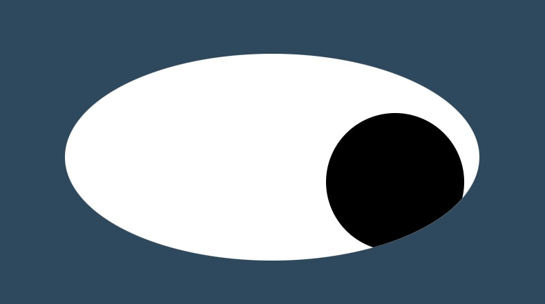

# Eye-Exercise
#### Description:
This project was a week 8 exercise. Using HTML, CSS, and Javascript, the eyes follow the cursor around the screen.

 
#### Installation:
 
You can copy the files into the same folder on your device. Then, you drag the .html file into the url line. Then, you can see the eyes watch your cursor's every move.
 
#### Usage:
 
Just for fun
 
#### Support: 
 
It doesn't really do enough to need support yet.
 
#### Roadmap: 
My plan is to make the eyes blick when the mouse is clicked and add eyelashes.
 
#### License information:
 
MIT license
